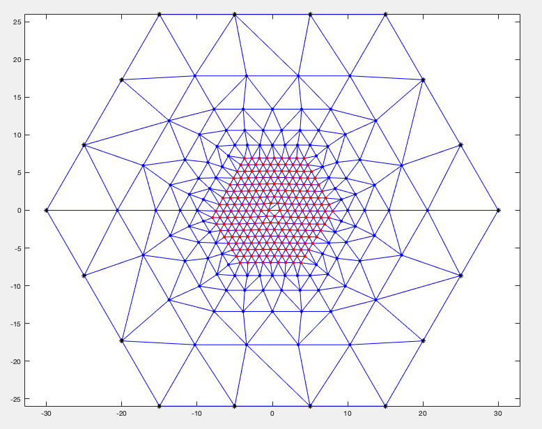
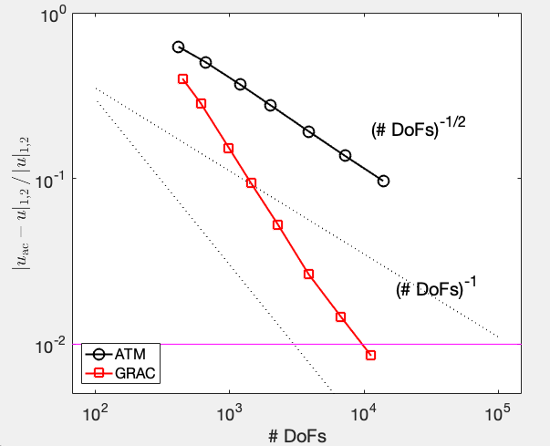

<!--
 * @Author: Yangshuai Wang
 * @Date: 2024-02-22 23:22:17
 * @LastEditTime: 2024-11-03 12:34:36
 * @LastEditors: Yangshuai Wang
 * @Description: Adaptive AC
 * @FilePath: /AC2D/examples/README.md
-->

# AC2D

**AC2D** is a computational package designed for atomistic-to-continuum (a/c) coupling methods, specifically for simulating and analyzing crystalline defects. This package is primarily developed and maintained by **Mingjie Liao** and **Yangshuai Wang**.

### Features

With **AC2D**, you can construct various coupled atomistic-to-continuum meshes for different types of defects, including:
- **Point Defects**: such as vacancies, microcracks, and Frenkel defects.
- **Dislocations**: including both screw and edge dislocations.

For example:
- The a/c mesh for a Frenkel defect:
  
  

- The a/c mesh for a single edge dislocation:
  
  

### Supported Methods

This package supports multiple atomistic-to-continuum coupling methods, enabling you to simulate, compare, and analyze their performance:
- **Blended Energy-based Quasi-Continuum (BQCE) Method**
- **Blended Force-based Quasi-Continuum (BQCF) Method**
- **Atomistic/Continuum Blending with Ghost Force Correction (BGFC) Method**
- **Geometric Reconstruction Atomistic-to-Continuum (GRAC) Method**

Using these methods, you can compute and visualize the convergence of each method with respect to the degrees of freedom (DoFs). Here’s an example of convergence analysis:
  


### Adaptive Algorithms

AC2D also includes adaptive algorithms for atomistic-to-continuum coupling methods, enabling efficient mesh refinement based on error estimation. For detailed examples and usage, refer to the [README](./examples/README.md).

## Development

AC2D is under active development. Please don't hesitate to open feature requests to help us guide development. We more than welcome contributions!

## Publications

AC2D has been used in the following publications:

1. [A posteriori error estimation and adaptive algorithm for the Atomistic/Continuum coupling in 2D (SIAM Journal on Scientific Computing, 2018)](https://epubs.siam.org/doi/abs/10.1137/17M1131106)<br> H. Wang, M. Liao, P. Lin and L. Zhang
2. [Adaptive Multiscale Coupling Methods of Molecular Mechanics based on a Unified Framework of a Posteriori Error Estimates](https://epubs.siam.org/doi/abs/10.1137/17M1131106)<br> H. Wang, M. Liao, P. Lin and L. Zhang
3. [Efficient a posteriori error control of a concurrent multiscale method with sharp interface for crystalline defects (Journal on Scientific Computing, 2023)](https://link.springer.com/article/10.1007/s10915-023-02362-8)<br> Y. Wang and H. Wang

## Citation

If you use the codes in a publication, please cite the repo using the .bib,

```
@misc{wang2023posteriori,
  title={A Posteriori Analysis and Adaptive Algorithms for Blended Type Atomistic-to-Continuum Coupling with Higher-Order Finite Elements},
  author={Wang, Yangshuai},
  journal={arXiv preprint arXiv:2308.16467},
  year={2023}
}
```


